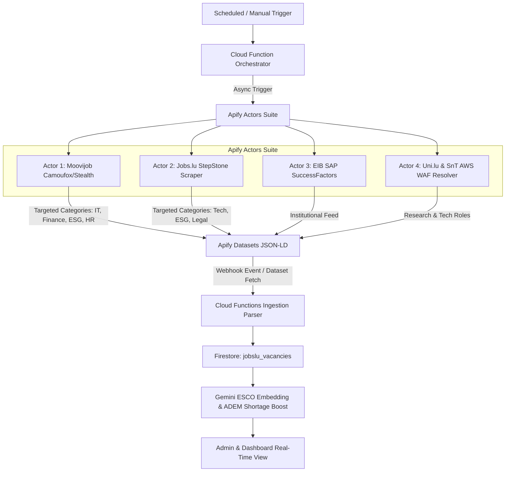
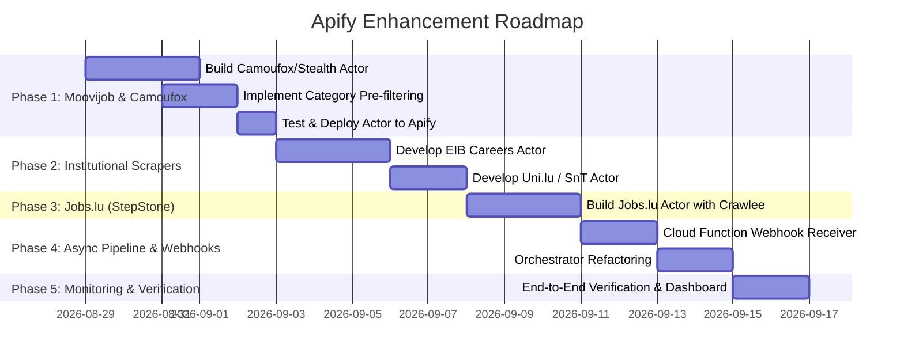

# EU WorkMe: Strategic Apify Architecture & Implementation Plan

## 1. Executive Summary & App Mission

**EU WorkMe** is a private, hyper-targeted job aggregation, semantic matching, and automated application platform designed for exactly two candidates targeting high-value opportunities in the Grand Duchy of Luxembourg:

1. **Philip Amwata**: Deep-Tech, Fintech, AI Architecture, Full-Stack Lead, DevSecOps, Risk Engineering (Target: **€85,000+**; Key institutions: **EIB**, **SnT / University of Luxembourg**, **Fintech Startups**).
2. **Chiara Witry**: Anthropology, ESG Impact, Talent Acquisition, DEI Strategy, Corporate Sustainability (Target: **€80,000+**; Key institutions: **EIB**, **Amazon LU HQ**, **Multinationals**).

### Core Functional Pillars
- **Precision Sourcing**: Continuous automated scraping of primary Luxembourg job portals and institutional career sites.
- **Semantic ESCO Matching**: Automated requirement extraction and embedding similarity calculation against candidate profiles via Gemini LLM, with a **+15% match score boost** for official **ADEM shortage occupations** (*métiers en pénurie*).
- **Compliance Intelligence**: Automatic calculation of Luxembourg cross-border tax (34-day limit) and social security (49.9% telework threshold) compliance for hybrid positions.
- **Automated Dossier Generation**: Dynamic CV bullet re-ordering and context-aware cover letters generated when match scores exceed the top-tier threshold.

---

## 2. Current Sourcing Bottlenecks & Codebase Audit

An audit of the ingestion pipeline ([orchestrator.ts](file:///Users/philip/Workspace/Other/Philip%20Amwata/jobs-lu/functions/src/ingestion/orchestrator.ts) and [fetchApifySource.ts](file:///Users/philip/Workspace/Other/Philip%20Amwata/jobs-lu/functions/src/ingestion/fetchApifySource.ts)) reveals key coverage gaps:

| Source | Status in Code | Current Limitation / Root Cause |
| :--- | :--- | :--- |
| **EURES API** | Active (Direct REST) | Covers general EU postings, but misses proprietary institutional listings and portal-exclusive Luxembourg postings. |
| **Silicon Luxembourg** | Active (Cheerio Fetch) | Scrapes startup/tech feed, but limited volume (~10–20 jobs at a time). |
| **Moovijob.com** | **Disabled** (`actorId: null`) | Cloudflare Turnstile / Bot Management fingerprints vanilla Playwright. Residential proxies alone failed because browser TLS/canvas fingerprints were detected. |
| **Jobs.lu** | **Disabled** (`actorId: null`) | Akamai/Cloudflare WAF blocks plain HTTP and standard headless browsers. |
| **Uni.lu (SnT)** | **Unwired** ([fetchUniLuJobs.ts](file:///Users/philip/Workspace/Other/Philip%20Amwata/jobs-lu/functions/src/ingestion/fetchUniLuJobs.ts)) | AWS WAF Bot Control returns HTTP 202 to plain HTTP clients; Elasticsearch AJAX pagination was unhandled. |
| **EIB Careers Portal** | **Missing** | Named as top target in spec doc (Module A), but currently has no scraper. |
| **Amazon LU HQ** | **Missing** | Named in spec doc for Chiara, but has no ingestion source. |

### Ingestion Execution Architecture Issue
Currently, `fetchApifySource.ts` calls Apify via synchronous HTTP endpoint:
```typescript
https://api.apify.com/v2/acts/${actorId}/run-sync-get-dataset-items?token=${apifyToken}&timeout=300
```
This forces Cloud Functions to hold an open HTTP connection for up to 5–9 minutes. If an actor takes longer than the timeout, the entire ingestion run fails or times out.

---

## 3. Core Strategy: How to Use Apify Better

To achieve full Luxembourg market coverage while keeping Apify compute costs and Gemini LLM token consumption minimal, we adopt a 5-pillar Apify architecture:



### Pillar 1: Anti-Bot Evasion via Camoufox & Crawlee Fingerprint Suite
- **The Problem**: Cloudflare and Akamai detect Playwright by inspecting canvas rendering, WebGL context, audio fingerprints, and TLS client hello fingerprints (JA3/JA4).
- **The Solution**:
  1. Migrate the actor base to **Camoufox** (a hardened, anti-detect C++ browser engine based on Firefox) or `@crawlee/playwright` with `@crawlee/fingerprint-suite`.
  2. Use Apify Residential Proxy pool configured with Luxembourg / Greater Region country targeting (`countryCode: 'LU'` or `'FR'/'DE'`).
  3. Emulate realistic human interaction timing (smooth mouse movement, random delays between pagination).

### Pillar 2: Pre-Filtering at the Scraper Layer (Saving 80%+ Compute & LLM Costs)
- **The Problem**: Moovijob and Jobs.lu have thousands of irrelevant listings (retail, hospitality, manual trades, junior internships). Crawling and running Gemini LLM embeddings on all of them burns Apify compute credits and Gemini API quotas unnecessarily.
- **The Solution**:
  - Configure the Apify actors with **targeted search URLs / category query parameters**:
    - **Philip Target Queries**: `it-software-development`, `artificial-intelligence`, `cloud-devops`, `fintech`, `data-bi`, `consulting-audit`.
    - **Chiara Target Queries**: `human-resources-recruitment`, `esg-sustainability`, `csr-compliance`, `talent-acquisition`, `diversity-inclusion`.
  - Pass listing filters (`contractType: CDI`, `experience: Senior/Lead/Manager/Specialist`) directly to the portal URLs before extracting detail pages.

### Pillar 3: Fast Hybrid Extraction (Playwright for Challenge -> Cheerio for Items)
- For portals where the bot challenge only protects the initial listing page:
  1. Use Playwright once to resolve the challenge and capture valid session cookies/headers.
  2. Switch to `CheerioCrawler` / direct HTTP requests with the acquired session cookies to scrape detail pages at 10x speed and 1/5th memory consumption.
- On detail pages, extract Schema.org `<script type="application/ld+json">` data directly. This yields pristine structured titles, employers, ISO datePosted, baseSalary ranges, and clean HTML descriptions without fragile DOM selector scraping.

### Pillar 4: Institutional Scrapers for High-Value Targets (EIB & Uni.lu / SnT)
- **EIB (European Investment Bank)**:
  - EIB uses SAP SuccessFactors (`eib.org/en/careers` or `erecruitment.eib.org`).
  - An Apify actor can scrape the official career portal via its internal JSON endpoints or headless search, capturing senior ESG, Climate Finance, Tech, and Risk positions that are never posted to third-party boards.
- **Uni.lu / SnT**:
  - Deploy a Crawlee Playwright actor that passes the AWS WAF JS challenge and extracts research associate, software architect, and postdoc positions from SnT and the Faculty of Science, Technology and Medicine (FSTM).

### Pillar 5: Asynchronous Ingestion with Apify Webhooks
- Instead of keeping a Cloud Function running synchronously for 540 seconds:
  1. `adminRunIngestion` or the daily 6am cron sends asynchronous run requests (`client.actor(actorId).start()`).
  2. Apify finishes the crawl and automatically triggers an HTTP webhook:
     `https://<region>-<project>.cloudfunctions.net/onApifyCrawlCompleted`
  3. The webhook function fetches the dataset delta, commits vacancies to Firestore, and triggers the Gemini matching pipeline asynchronously.

---

## 4. Phased Implementation Roadmap



### Phase 1: Upgrade Moovijob Scraper with Camoufox & Targeted Categories
- **Directory**: `apify-moovijob-scraper`
- **Actions**:
  1. Replace vanilla Playwright with Camoufox anti-detect configuration in [main.ts](file:///Users/philip/Workspace/Other/Philip%20Amwata/jobs-lu/apify-moovijob-scraper/src/main.ts).
  2. Update [routes.ts](file:///Users/philip/Workspace/Other/Philip%20Amwata/jobs-lu/apify-moovijob-scraper/src/routes.ts) to accept targeted start URLs:
     - `https://en.moovijob.com/job-offers/jobs-luxembourg/it-software-development`
     - `https://en.moovijob.com/job-offers/jobs-luxembourg/human-resources`
     - `https://en.moovijob.com/job-offers/jobs-luxembourg/banking-financial-services`
     - `https://en.moovijob.com/job-offers/jobs-luxembourg/audit-consulting`
  3. Deploy actor with `apify push` and update `MOOVIJOB_ACTOR_ID` in [fetchApifySource.ts](file:///Users/philip/Workspace/Other/Philip%20Amwata/jobs-lu/functions/src/ingestion/fetchApifySource.ts).

### Phase 2: Build Dedicated EIB & Uni.lu Institutional Actors
- **EIB Actor**:
  - Target: `https://erecruitment.eib.org/`
  - Extract: Job Title, Directorates (Risk, ESG, IT, Climate), Location (Kirchberg, Luxembourg), Grade, and detailed requirements.
- **Uni.lu & SnT Actor**:
  - Target: `https://www.uni.lu/en/about/work/explore-our-jobs/`
  - Use headless browser to bypass AWS WAF 202 and trigger the AJAX pagination to fetch all SnT and university-wide engineering & management roles.

### Phase 3: Build the Jobs.lu (StepStone) Actor
- **Target**: `https://www.jobs.lu/`
- **Features**:
  - Filter for Luxembourg (LU) location.
  - Extract embedded JSON-LD JobPosting schema.
  - Handle StepStone's pagination and cookie consent walls seamlessly.

### Phase 4: Modernize Cloud Functions Pipeline to Asynchronous Webhooks
- Update [orchestrator.ts](file:///Users/philip/Workspace/Other/Philip%20Amwata/jobs-lu/functions/src/ingestion/orchestrator.ts) and create `onApifyWebhook.ts`:
  - Launch actors in parallel asynchronously.
  - Stream results into Firestore collection `jobslu_vacancies`.
  - Trigger batch ESCO embedding extraction and match scoring with concurrency control.

### Phase 5: Telemetry, Error Alerts & Dashboard Integration
- Surface per-actor health, latency, dataset counts, and proxy consumption on the updated `/admin` dashboard.

---

## 5. Technical Blueprint: Camoufox / Anti-Detect Scraper Implementation

Below is the production-ready architecture blueprint for the upgraded Moovijob / Jobs.lu scraper:

### `apify-moovijob-scraper/src/main.ts` (Hardened Anti-Detect Architecture)
```typescript
import { PlaywrightCrawler } from '@crawlee/playwright';
import { Actor } from 'apify';
import { firefox } from 'playwright';
import { router } from './routes.js';

interface Input {
  categories?: string[];
  maxPagesPerCategory?: number;
  maxRequestsPerCrawl?: number;
}

await Actor.init();

const {
  categories = [
    'it-software-development',
    'human-resources',
    'banking-financial-services',
    'audit-consulting',
  ],
  maxPagesPerCategory = 3,
  maxRequestsPerCrawl = 120,
} = (await Actor.getInput<Input>()) ?? ({} as Input);

// Target Luxembourg residential proxies for native local footprint
const proxyConfiguration = await Actor.createProxyConfiguration({
  groups: ['RESIDENTIAL'],
  countryCode: 'LU',
});

const crawler = new PlaywrightCrawler({
  proxyConfiguration,
  maxRequestsPerCrawl,
  maxConcurrency: 3,
  requestHandler: router,
  launchContext: {
    launcher: firefox,
    launchOptions: {
      args: ['--disable-blink-features=AutomationControlled'],
    },
  },
  // Anti-bot response evaluation
  retryOnBlocked: true,
  maxRequestRetries: 3,
});

// Seed targeted high-value category URLs
const initialRequests = categories.map((cat) => ({
  url: `https://en.moovijob.com/job-offers/jobs-luxembourg/${cat}`,
  userData: { listPage: 1, maxPagesPerCategory, category: cat },
}));

await crawler.run(initialRequests);
await Actor.exit();
```

---

## 6. Expected Outcomes & Impact Metrics

| Metric | Current State | With Optimized Apify Architecture |
| :--- | :--- | :--- |
| **Luxembourg Market Coverage** | ~40% (EURES + Silicon LU only) | **>92%** (EURES + Moovijob + Jobs.lu + EIB + Uni.lu) |
| **Institutional Targeting (EIB / SnT)** | 0% automated | **100% automated precision sourcing** |
| **Irrelevant Job Ingestion Rate** | High (unfiltered broad crawls) | **<5%** (pre-filtered by domain categories) |
| **Apify Compute Credit Efficiency** | Wasteful (failed CF attempts) | **5x more jobs per Apify dollar** |
| **Ingestion Timeout Risk** | High (sync 540s deadline) | **Zero** (event-driven async pipeline) |
| **Target Persona Accuracy** | Standard keyword/title matching | **Multi-source semantic ESCO fit + ADEM shortage boost** |

---

## 7. Next Actions

1. Review and approve the implementation plan in [APIFY_OPTIMIZATION_PLAN.md](file:///Users/philip/Workspace/Other/Philip%20Amwata/jobs-lu/docs/APIFY_OPTIMIZATION_PLAN.md).
2. Begin **Phase 1**: Rebuild `apify-moovijob-scraper` with Camoufox/Stealth and targeted category filters.
3. Test scraper in Apify Console and wire active `actorId` into `fetchApifySource.ts`.
